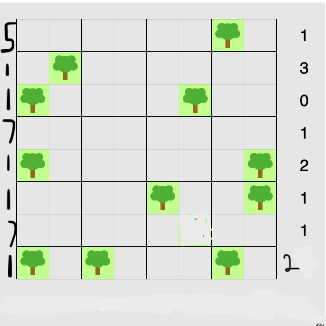
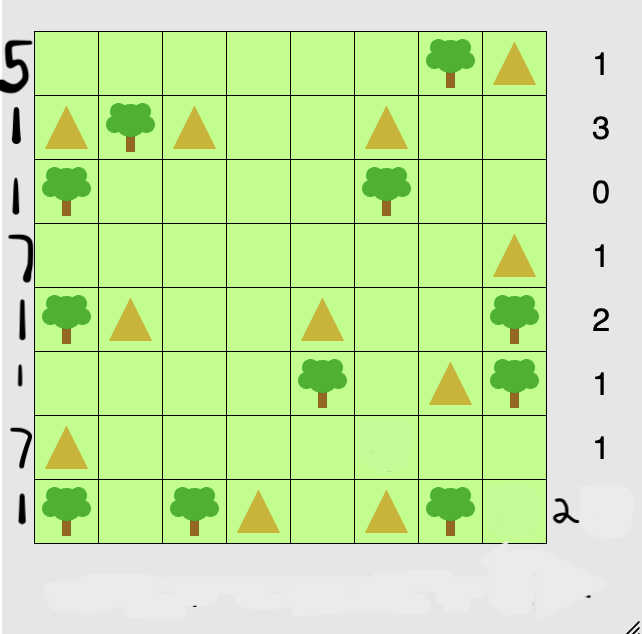
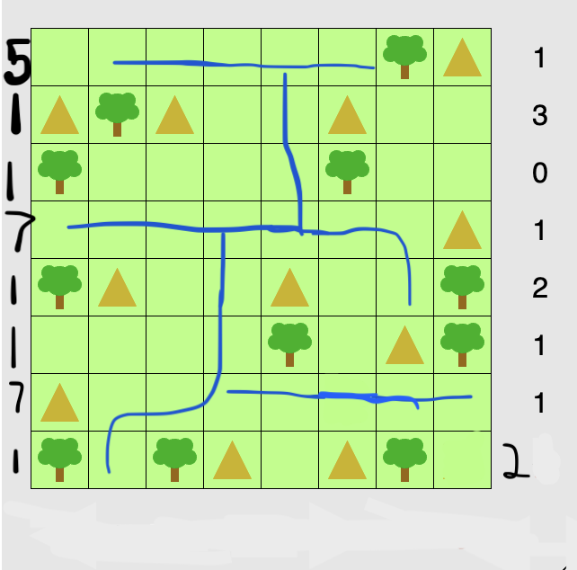

# 2024 Fall Final Projects

# **TENTS FINAL**

### **Rules**

##### Original Rules

- There are exactly as many tents as trees.

- The tents and trees can be matched up in such a way that each tent is directly adjacent (horizontally or vertically, but not diagonally) to its own tree. However, a tent may be adjacent to other trees as well as its own.

- No two tents are adjacent horizontally, vertically or diagonally.

- The number of tents in each row, and in each column, matches the numbers given round the sides of the grid.

##### Additional Rules

- For tents, they have to have a space a land next to them and a tree.

- However for the tree, they have to have a water by them, for them to grow. A tent cannot be surrounded by water because they need to step out of it.

- Water must be all connected and orthogonally.

- Since there is water, there will also be water hints, BUT to keep the challenge there will only be the hints for the rows, meaning that there will be hints only in each side of the row. The hints on the left will be for water and the hints on the right will be for tents.

### Backtracker 
For the backtracker the big O of this function would be BigO(n^k * m^l). k would be the number of times it is calling the backtracking function which is the height of the board and l would be the number of times the validator is being checked. As n and m both of these functions have loops, this is why this is the Big O.
